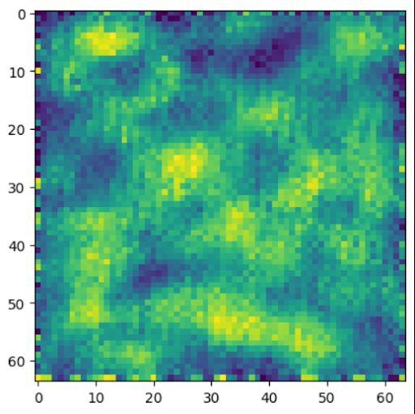

# Random-like Sampling from an overfitted model

## Reproduction

- `pip install imagen-pytorch transformers datasets`

## Description

The Imagen model is trained from scratch on a single sample. Losses for both Unets (for low-resolution denoising and super-resolution upsampling) go down steadily, while sampling quality does not improve.

## Setup

Imagen with 200 training and 200 inference steps, trained for 100 epochs on a single sample.

## Expected Results

The model remembers the training sample and generates it perfectly.

## Results

Unconditional sampling:

## Potential causes

- training and sampling stages work with different dtypes
- loss is not a good indicator of overfitting in case of diffusion models (generation ability may improve even if loss does not decrease)
- training for too few epochs